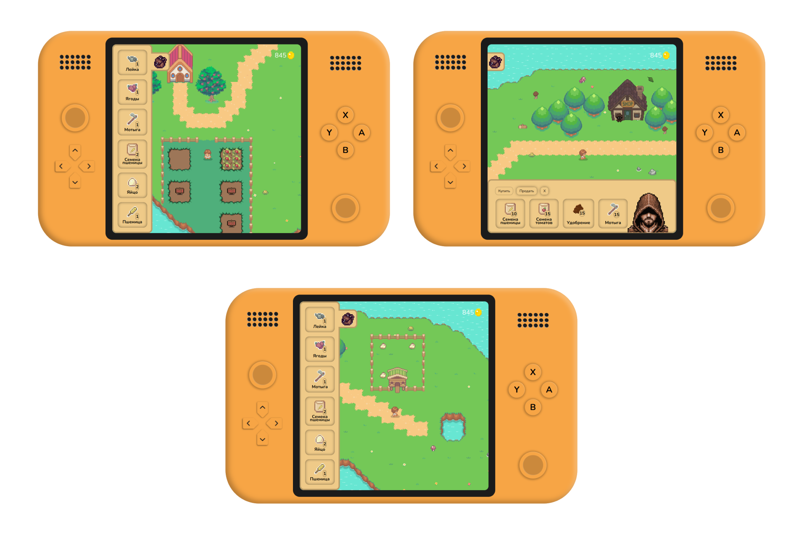

# Simple farming game
This is a farm simulation game built with Vue.js. Here, you manage your island farm by:\
🌱Growing crops: Plant and harvest apples, berries, wheat, and tomatoes\
🐣Raising chickens: Care for your chickens and collect eggs\
📜GUI interface: Manage your farm with a user-friendly interface built with Vue.js\
🎧Soundscapes: Enjoy relaxing island sounds while you play\

### Technical details
* Developed using Vue.js framework
* Features a simple and intuitive user interface
* Includes sound effects for an immersive gameplay experience
### Screenshots

